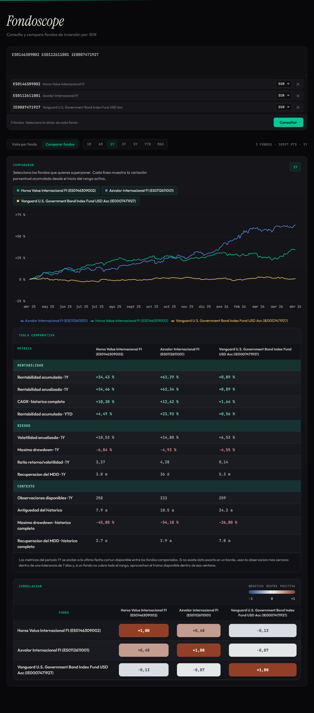

# Fondoscope

Fondoscope is a web app for looking up and comparing investment funds by ISIN.

Paste one or more ISINs, choose a currency for each fund, and review their historical performance in cards, charts, comparison tables, and correlation views.

## Live Demo

https://fondoscope-plum.vercel.app/

## Preview



## What It Does

- Loads multiple funds from ISIN codes
- Lets you assign a different currency to each fund
- Compares performance across common time ranges
- Shows per-fund cards, an overlay chart, a comparison table, and a correlation matrix
- Highlights unresolved funds or data retrieval errors

## Tech Stack

- Next.js
- React
- Recharts
- Python
- pandas
- requests

## Local Development

Requirements:

- Node.js 20+
- Python 3.13
- npm

Install dependencies:

```bash
npm install
python3 -m venv .venv
. .venv/bin/activate
pip install pandas requests
```

Start the app:

```bash
npm run dev
```

The app is usually available at `http://localhost:3000`.

Validate the project:

```bash
npm run check
```

## Data Source

Fondoscope retrieves fund metadata and historical series from public Morningstar endpoints.
