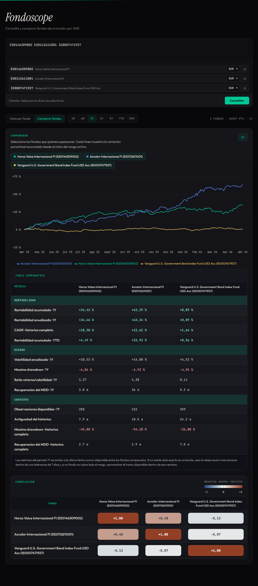

# Fondoscope

Fondoscope is a web app for looking up and comparing funds, stocks, and ETFs by ISIN or Yahoo Finance symbol.

Paste one or more ISINs or Yahoo Finance symbols and review their historical performance in cards, charts, comparison tables, and correlation views.

## Live Demo

https://fondoscope-plum.vercel.app/

## Preview



## What It Does

- Loads multiple assets from fund ISINs and Yahoo Finance symbols in the same input
- Detects and displays each asset's native currency
- Compares performance across common time ranges
- Shows per-asset cards, an overlay chart, a comparison table, and a correlation matrix
- Shares the current comparison through its URL and shows each asset's data source and latest date
- Highlights unresolved assets or data retrieval errors

## Tech Stack

- Next.js
- React
- Recharts
- Python
- pandas
- requests

## Local Development

Requirements:

- Node.js 20+
- Python 3.13
- pnpm 9

Install dependencies:

```bash
pnpm install
python3 -m venv .venv
. .venv/bin/activate
pip install pandas requests
```

Start the app:

```bash
pnpm run dev
```

The app is usually available at `http://localhost:3000`.

Validate the project:

```bash
pnpm run check
```

## Data Source

Fondoscope retrieves ISIN data from public Morningstar endpoints and symbol data from Yahoo Finance.
Input accepts ISINs with a valid check digit and Yahoo Finance symbols; URLs are rejected.
ISINs are fetched from Morningstar, while Yahoo symbols are fetched directly from Yahoo Finance and may identify funds, stocks, ETFs, indices, or other supported instruments.
Each instrument is loaded in its native currency: Morningstar uses the fund share class currency and Yahoo uses the quoted currency. No FX conversion is applied.
Yahoo closing prices are used, without dividend adjustments, and the actual provider is shown in the fund input list.
