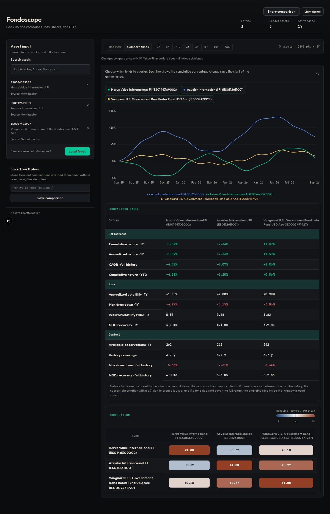
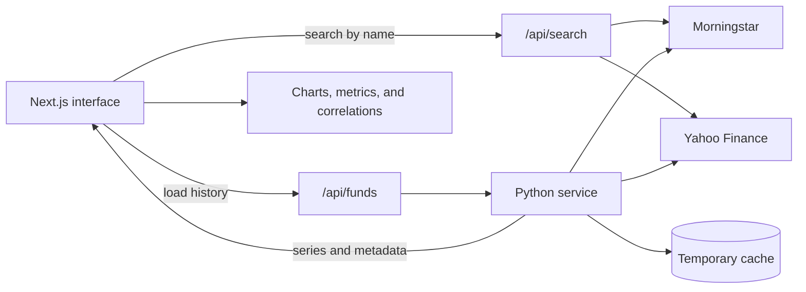

# Fondoscope

**Analyze and compare mutual funds, stocks, ETFs, and indices from one interface.**

[](https://fondoscope-plum.vercel.app/)

Fondoscope searches for assets by name, retrieves their historical data from Morningstar or Yahoo Finance, and turns it into visual performance and risk comparisons. It supports up to eight assets at once, shareable comparisons through the URL, and browser-based portfolio storage.

<p align="center">
  <a href="https://fondoscope-plum.vercel.app/">
    
  </a>
</p>

<p align="center"><em>Current interface: one-year comparison using reproducible demo data, risk metrics, and correlation.</em></p>

## Features

- Search Morningstar and Yahoo Finance by asset name, using either the keyboard or mouse.
- Load mutual funds by ISIN and exchange-traded assets—such as stocks, ETFs, and indices—by Yahoo symbol.
- Compare up to eight assets simultaneously in their native currencies.
- Switch between `1M`, `6M`, `YTD`, `1Y`, `3Y`, `5Y`, `10Y`, and `MAX` time ranges.
- Inspect each asset's price or NAV history, latest value, and change over the selected period.
- Compare normalized cumulative percentage changes in an overlay chart.
- Review cumulative and annualized returns, CAGR, volatility, maximum drawdown, recovery time, and return-to-volatility ratio.
- Explore Pearson correlations calculated from returns over shared dates.
- Save frequently used portfolios in `localStorage`, with no account or database required.
- Share comparisons through a URL that preserves the selected assets and time range.
- Use light or dark themes, responsive layouts, and automatic English or Spanish localization based on browser settings.
- See the data source, native currency, and latest available date for every asset.

## How it works


```mermaid
flowchart LR
    A[Next.js interface] -->|search by name| B["/api/search"]
    B --> C[Morningstar]
    B --> D[Yahoo Finance]
    A -->|load history| E["/api/funds"]
    E --> F[Python service]
    F --> G[(Temporary cache)]
    F --> C
    F --> D
    F -->|series and metadata| A
    A --> H[Charts, metrics, and correlations]
```

During development, the Next.js route executes the Python service locally. On Vercel, requests are forwarded to a serverless Python function. Historical series are fetched concurrently and cached for six hours to reduce repeated provider requests.

## Tech stack

| Layer | Technology |
| --- | --- |
| Frontend | Next.js 15, React 19, Recharts 3 |
| Web API | Next.js Route Handlers |
| Data | Python 3.13, pandas, requests |
| Providers | Morningstar and Yahoo Finance |
| Deployment | Vercel |

## Run locally

### Requirements

- Node.js 20 or newer
- pnpm 9
- Python 3.13 or newer

### Installation

```bash
pnpm install

python3 -m venv .venv
source .venv/bin/activate
python -m pip install -e .
```

No environment variables or API keys are required.

### Development

With the virtual environment activated:

```bash
pnpm dev
```

Open [http://localhost:3000](http://localhost:3000). The first data request requires an internet connection to reach the external providers.

### Checks and local production

```bash
# Backend tests
python -m unittest discover -s tests -p 'test_*.py'

# Lint and build the Next.js application
pnpm check

# Run the production build
pnpm start
```

`pnpm start` requires a previous `pnpm check` or `pnpm build`.

## Project structure

```text
app/                 Next.js application and web endpoints
components/          Search, portfolios, charts, and tables
lib/                 Financial calculations, validation, and i18n
backend/funds/       Data clients and Python service
api/                 Python function for Vercel
tests/               Backend and UI regression tests
docs/images/         Documentation screenshots
```

## Data sources and calculation rules

- **Morningstar** resolves funds by ISIN and returns the history for the matching share class.
- **Yahoo Finance** provides historical data for exchange-traded symbols, including stocks, ETFs, and indices.
- Every asset is displayed in its native currency; Fondoscope does not perform currency conversion.
- Yahoo data uses unadjusted closing prices and does not include dividends.
- Comparisons are anchored to the latest date shared by all selected assets. If an exact observation is unavailable at a period boundary, the nearest one within seven days is used.
- Volatility is annualized over 252 trading sessions, while correlation uses consecutive returns over shared intervals.

## Disclaimer

Fondoscope is an informational tool and does not provide financial advice. Its data comes from public third-party services, may be delayed or become unavailable, and should be independently verified before making investment decisions.

## License

Distributed under the ISC License.
